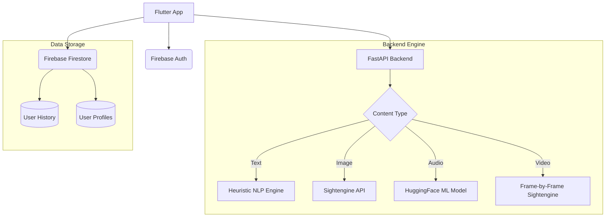

# 🛡️ Unveil - AI Content Detector & Deepfake Protection

Unveil is a comprehensive cross-platform application designed to detect AI-generated content and Deepfakes across **Text, Images, Audio, and Video**. Built with Flutter and FastAPI, it provides a production-ready solution for verifying digital authenticity.

---

## 🚀 Key Features

*   **📝 Text Analysis**: Detects AI-generated text (ChatGPT, Gemini, etc.) using advanced linguistic heuristics.
*   **🖼️ Image Analysis**: Identifies synthetic images and AI-manipulated photos via professional GenAI detection APIs.
*   **🎙️ Audio Analysis**: Uses deep-learning models (Wav2Vec2) to detect synthetic voices and cloned speech.
*   **🎬 Video Analysis**: Scans video frames for deepfake indicators and visual inconsistencies.
*   **💾 History Persistence**: Securely saves all analysis results to **Firebase Firestore**, accessible across all user devices.
*   **🔐 Authentication**: Full user lifecycle management (Sign Up, Login, Password Reset) via **Firebase Auth**.
*   **🌍 Multi-language Support**: Fully localized in English and Arabic with RTL support.

---

## 🛠️ Technology Stack

### Frontend (Mobile & Web)
*   **Framework**: [Flutter](https://flutter.dev/) (3.x)
*   **State Management**: Reactive Streams (Firebase Auth / Firestore)
*   **Responsiveness**: `flutter_screenutil` for multi-device support.
*   **UI Components**: Custom reusable design system for consistency.

### Backend (AI Engine)
*   **Framework**: [FastAPI](https://fastapi.tiangolo.com/) (Python)
*   **AI Models**: 
    *   **Audio**: HuggingFace `wav2vec2-deepfake-voice-detector`
    *   **Visual**: [Sightengine API](https://sightengine.com/) (Professional GenAI detection)
    *   **Text**: Custom heuristic NLP engine.
*   **Processing**: `pydub`, `opencv`, `librosa`.

---

## 🏗️ Project Architecture

The project follows a clean, modular architecture:



---

## 📁 File Structure

### Frontend (`lib/`)
*   `core/`: App styles, typography, and responsive wrappers.
*   `widgets/`: Reusable UI components (Buttons, Input fields, Result cards).
*   `pages/`: Application screens (Login, Signup, Analysis pages, Profile, History).
*   `firebase_options.dart`: Multi-platform Firebase configuration.

### Backend (`backend/`)
*   `main.py`: FastAPI server with all AI detection endpoints.
*   `requirements.txt`: Python dependencies.
*   `.env`: API keys and environment variables.

---

## 🚦 Getting Started

### 1. Prerequisites
*   Flutter SDK installed.
*   Python 3.9+ installed.
*   Sightengine API Key.

### 2. Backend Setup
```bash
cd backend
pip install -r requirements.txt
# Create a .env file with your API keys
uvicorn main:app --reload
```

### 3. Frontend Setup
```bash
flutter pub get
flutter run
```

---

## 🔒 Security & Data Privacy
*   **Isolated Data**: Each user's history is isolated using Firebase Security Rules and UID-based Firestore collections.
*   **Encryption**: Data in transit is handled via HTTPS.
*   **Persistence**: Analysis results remain in the history even after logout/re-login.

---

## 📄 Documentation & Maintenance
Every file in this project is documented with:
1.  **Class-level documentation**: Explaining the purpose of each widget/service.
2.  **Function-level documentation**: Explaining inputs, outputs, and logic.
3.  **Comments**: Explaining non-obvious code blocks for future developers.

---
*Created with ❤️ by the Unveil Team.*
